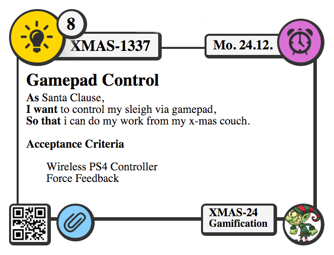

# Jira-Issue-Card-Printer
Beautiful Jira Issue Card Printer

This little bookmarklet converts Jira issues in a pretty card layout for printing.

Just follow the next steps and you are ready to print.

### Card Layout


### Installation
#### Drag'n'Drop
ONLY Chrome and Safari are SUPPORTED!

got to [Instalation Site](https://mrst.github.io/Jira-Issue-Card-Printer/bookmarkInstalation.html)

*or*

#### Manually
Create Bookmark with folowing content.

NOTE THAT ONLY Chrome and Safari are SUPPORTED!

```
javascript:(function(){ var script = document.createElement("script"); script.src = "https://mrst.github.io/Jira-Issue-Card-Printer/bookmarklet.js"; document.body.appendChild(script); document.body.removeChild(script);})();
```

### Usage
Just select Issue(s) then run the Bookmarklet.

Marker to separate description into print and no print area ("~~~~~")

#### Select multible issues
##### Jira Agile
holding STRG / CMD or SHIFT and click on issues
##### Jira Classic
search for issues und select *List View*

### Support
#### Browser
* **Chrome Browsers 46+**
* **Safari 9+**.

#### Issue tracker
* **Jira**

